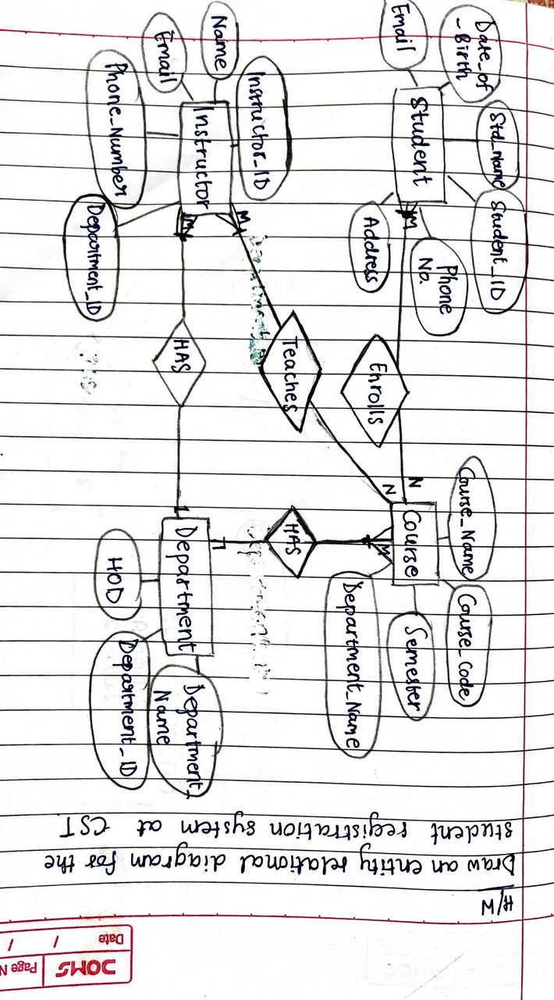
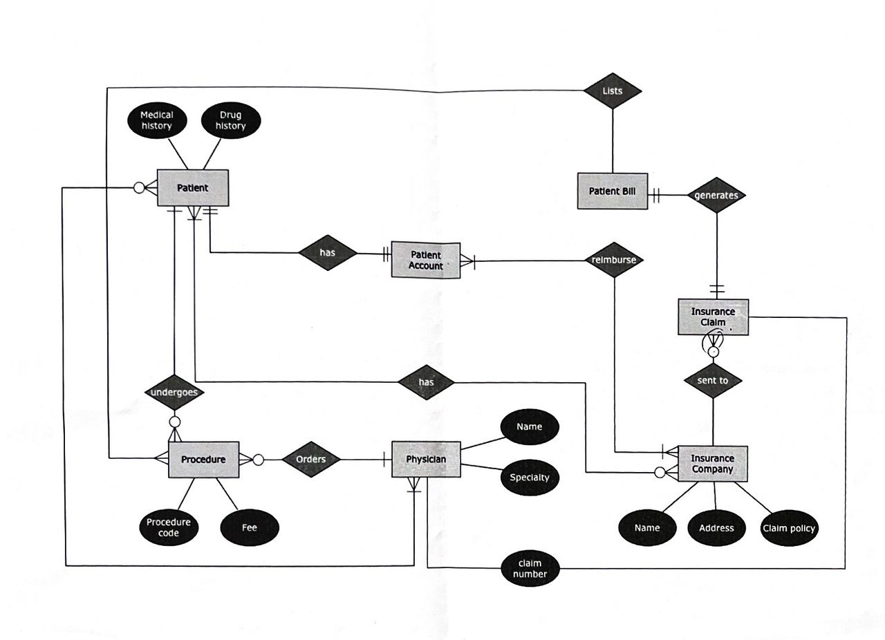
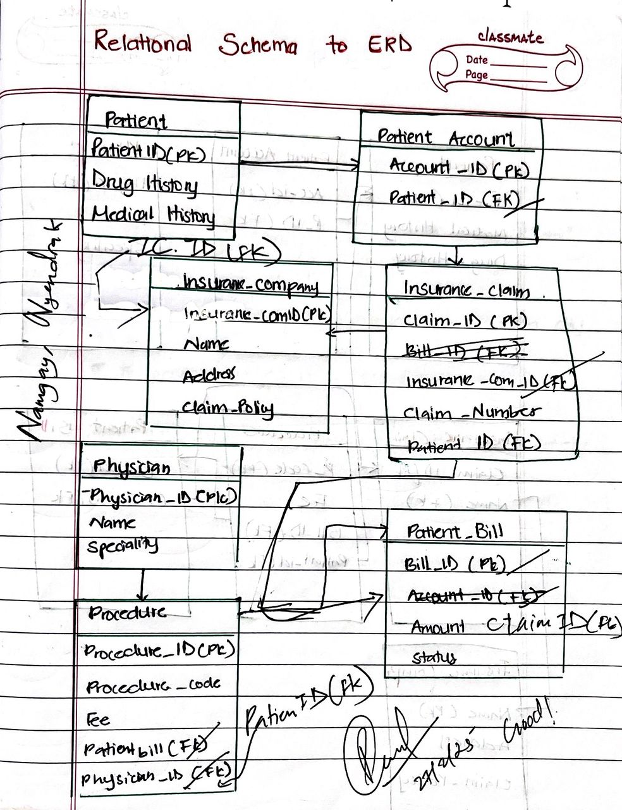

# Topic: Database Design and Modeling 🗂️

---

## [Lesson 3: Entity-Relationship Diagrams (ERD)] 📊

### Key Concepts:

#### Entity: 🧑‍🎓
A “thing” or “object” in the real world that is distinguishable from other objects. For example, a **Student** or a **Course**.

#### Attributes: 📝
Descriptive properties possessed by each entity. For example, a **Student** entity might have attributes like **Name**, **StudentID**, and **Address**.

#### Relationships: 🤝
An association among several entities. For example, a **Student** enrolls in a **Course**.

---

### Types of Attributes:
1. **Simple Attributes**: 🎯 Cannot be divided into subparts (e.g., **Age**).
2. **Composite Attributes**: 🧩 Can be divided into subparts (e.g., **Address** can be divided into **Street**, **City**, **ZipCode**).
3. **Single-Valued Attributes**: 1️⃣ Have only one value for a particular entity (e.g., **StudentID**).
4. **Multi-Valued Attributes**: 📞 Can have more than one value for a particular entity (e.g., **Phone Numbers**).
5. **Derived Attributes**: 🧮 Values can be derived from other attributes (e.g., **Age** can be derived from **Date of Birth**).

---

### Mapping Cardinalities:
Cardinality defines the number of entities in one entity set that can be associated with the number of entities in another set. The types are:
1. **One-to-One (1:1)**: ↔️ One entity in A is associated with at most one entity in B.
2. **One-to-Many (1:N)**: ➡️ One entity in A is associated with many entities in B.
3. **Many-to-One (N:1)**: ⬅️ Many entities in A are associated with one entity in B.
4. **Many-to-Many (M:N)**: 🔄 Many entities in A are associated with many entities in B.

---

### ERD Notations:
ERDs use symbols to represent entities, attributes, and relationships. For example:
- **Entities** are represented by rectangles. 🟦
- **Attributes** are represented by ovals. ⚪
- **Relationships** are represented by diamonds. 💎

---

### Reflection:
Learning about ERDs was like learning a new language for me. At first, it felt overwhelming with all the symbols and rules, but as I practiced drawing diagrams for different scenarios, it started to make sense. I realized how powerful ERDs are in visualizing the structure of a database. It’s like creating a blueprint before building a house—it helps you see the big picture and avoid mistakes later. 

---

## [Lesson 4: Relational Model and Schema Design] 🗄️

### Key Concepts:

#### Relational Model:
A database model based on the concept of relations (tables). Each table represents an entity, and each row represents a tuple (record). 📊

#### Primary Key: 🔑
A unique identifier for each tuple in a table. For example, **StudentID** in a **Student** table.

#### Foreign Key: 🔗
An attribute in one table that refers to the primary key in another table. For example, **CourseID** in a **Student** table might refer to the **Course** table.

---

### Relational Database Terms:
- **Relation**: A table. 🗂️
- **Tuple**: A row in the table. 📜
- **Attribute**: A column in the table. 📊
- **Schema**: The logical design of the database. 🧠
- **Instance**: A snapshot of the database at a given time. 📸

---

### Relational Model Constraints:
1. **Domain Constraints**: 🛑 Ensure that each attribute has a valid value.
2. **Key Constraints**: 🔐 Ensure that each tuple is uniquely identified by its primary key.
3. **Referential Integrity**: 🔗 Ensures that a foreign key value must match a primary key value in another table.

---

### Reflection:
The relational model felt more concrete compared to ERDs. It was like moving from the design phase to the actual construction of the database. I found the concept of primary and foreign keys particularly interesting because they help maintain the integrity of the data. It’s like having a system of checks and balances to ensure everything is connected correctly. 

---

## [Lesson 5: ERD to Relational Schema Translation] 🔄

### Key Concepts:

#### Steps to Convert ERD to Relational Schema:
1. **Create a Table for Each Entity**: Each entity becomes a table, and its attributes become columns. 🗂️
2. **Handle Composite Attributes**: Only include the sub-attributes in the table. 🧩
3. **Handle Multivalued Attributes**: Create a separate table for them. 📂
4. **Handle Relationships**:
   - **1:1 Relationship**: Add a foreign key to one of the tables. ↔️
   - **1:N Relationship**: Add a foreign key to the table on the “many” side. ➡️
   - **M:N Relationship**: Create a new table with foreign keys from both entities. 🔄

---

### Special Cases:
- **Weak Entities**: These depend on another entity for their existence. For example, a **Loan** entity might depend on a **Customer** entity. 🏦
- **Ternary Relationships**: Involve three entities. For example, a **Student**, **Course**, and **Instructor** might be linked in a single relationship. 🎓📚👨‍🏫

---

### Reflection:
Translating ERDs to relational schemas was like solving a puzzle. At first, it was challenging to figure out where to place foreign keys and how to handle complex relationships, but with practice, it became more intuitive. I realized how important it is to think carefully about the relationships between entities to avoid data redundancy and ensure efficient queries. 

---

## [Lesson 6: Relational Algebra] ➕➖✖️➗

### Key Concepts:

#### Relational Algebra:
A theoretical foundation for relational databases and SQL. It consists of operations that take one or more relations as input and produce a new relation as output. 🧮

---

### Basic Operations:
1. **Select (σ)**: Chooses tuples that satisfy a given condition.
   - Example: `σ_age>30(Employee)` selects employees older than 30. 🎯
2. **Project (π)**: Selects specific columns from a relation.
   - Example: `π_name, salary(Employee)` selects only the **Name** and **Salary** columns. 📊
3. **Union (∪)**: Combines tuples from two relations.
   - Example: `Employee ∪ Manager` combines all employees and managers. 🤝
4. **Intersection (∩)**: Finds common tuples in two relations.
   - Example: `Employee ∩ Manager` finds employees who are also managers. 🔍
5. **Difference (−)**: Finds tuples in one relation that are not in another.
   - Example: `Employee − Manager` finds employees who are not managers. ➖
6. **Cartesian Product (×)**: Combines every tuple from one relation with every tuple from another.
   - Example: `Employee × Department` combines every employee with every department. ✖️
7. **Join (⨝)**: Combines tuples from two relations based on a condition.
   - Example: `Employee ⨝ Department` joins employees with their departments. 🔗

---

### Reflection:
Relational algebra felt like learning the grammar of a new language. At first, the symbols and operations seemed abstract, but as I worked through examples, I began to see how they translate into SQL queries. It’s fascinating how these operations form the foundation of database querying and manipulation. I can now appreciate the elegance of relational algebra in breaking down complex queries into simple, logical steps. 

---

## Overall Reflection for Unit 2: 🌟

Unit 2 has been a deep dive into the world of database design and modeling. From creating ERDs to translating them into relational schemas and understanding the theoretical underpinnings of relational algebra, I’ve gained a solid foundation in how databases are structured and queried. 

One of the biggest takeaways for me was realizing the importance of careful planning in database design. A well-designed database not only stores data efficiently but also makes it easier to retrieve and manipulate that data. I’m excited to apply these concepts in real-world projects and see how they can improve system performance and data integrity. 

---

### Screenshots:
- **Task 1:**

- **Task 2:**:
 

