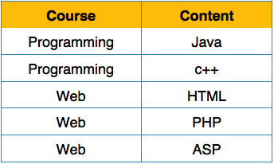
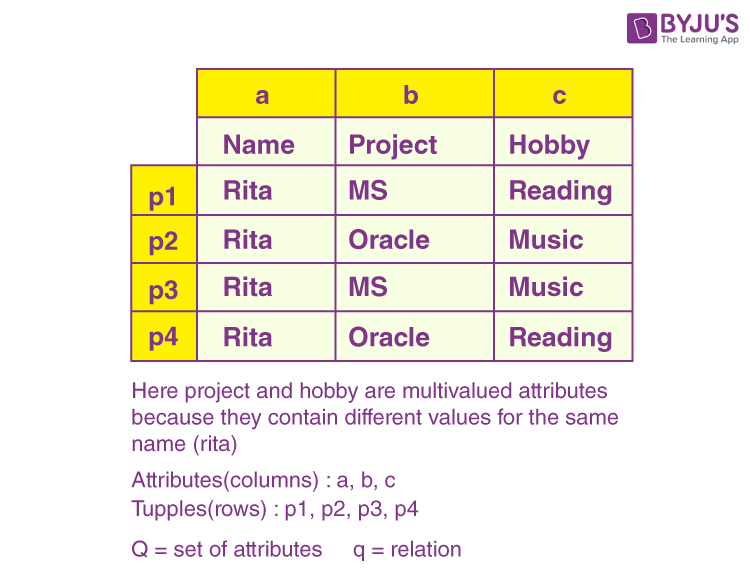

# Database Systems Fundamentals: Normalization & Design 🗃️  
**Topic: Database Systems Fundamentals - Unit 5**  

---

## [Lesson 12]  
### **Key Concepts**  

#### **Features of Good Relational Designs**  
1. **Relation for Every Entity**  
   - Each tuple represents one entity/relationship.  
   - Avoid mixing attributes of different entities; use foreign keys for references.  

2. **Minimize NULL Values**  
   - Design schemas to reduce NULL occurrences (e.g., separate optional attributes into new relations).  

3. **No Spurious Tuples (Lossless Decomposition)**  
   - Ensures joins do not produce erroneous tuples.  
   - Formula: \( R_1 \bowtie R_2 = R \) (original relation).  

4. **No Redundancy**  
   - Redundancy causes:  
     - Storage waste.  
     - Update/delete anomalies.  

5. **No Modification Anomalies**  
   - **Update Anomaly**: Inconsistent updates (e.g., changing an address in one record but not others).  
   - **Deletion Anomaly**: Unintentional data loss (e.g., deleting a customer’s only order removes their details).  
   - **Insertion Anomaly**: Cannot insert data due to missing dependencies (e.g., needing an order to add a customer).  

#### **Functional Dependency (FD) Theory**  
- **Notation**: \( X \rightarrow Y \) (X determines Y).  
- **Closure of FDs (\( F^+ \))**: All FDs logically implied by a set \( F \).  
- **Armstrong’s Axioms**:  
  - **Reflexivity**: If \( \beta \subseteq \alpha \), then \( \alpha \rightarrow \beta \).  
  - **Augmentation**: If \( \alpha \rightarrow \beta \), then \( \alpha \gamma \rightarrow \beta \gamma \).  
  - **Transitivity**: If \( \alpha \rightarrow \beta \) and \( \beta \rightarrow \gamma \), then \( \alpha \rightarrow \gamma \).  

#### **Normal Forms**  
| **Normal Form** | **Rule** | **Example Fix** |  
|-----------------|----------|----------------|  
| **1NF** | All attributes atomic (no composite/multi-valued). | Split `address` into `street`, `city`, `state`. |  
| **2NF** | No partial dependency (non-prime attributes depend on the entire PK). | Decompose `(StudentID, CourseID) → Grade, CourseName` into `(CourseID → CourseName)` and `(StudentID, CourseID → Grade)`. |  
| **3NF** | No transitive dependencies (non-prime attributes depend only on PK). | Separate `(EmployeeID → Dept, Dept → Manager)` into `(EmployeeID → Dept)` and `(Dept → Manager)`. |  
| **BCNF** | For every FD \( X \rightarrow Y \), \( X \) must be a superkey. | Decompose `(ID, dept_name) → building` into `(dept_name → building)` and `(ID → name, salary)`. |  

### First Normal Form

We re-arrange the relation (table) as below, to convert it to First Normal Form.

#### **Decomposition Algorithms**

Here’s a concise **comparison table** between **3NF (Third Normal Form)** and **BCNF (Boyce-Codd Normal Form)**, highlighting their key differences with examples:

---

### **3NF vs BCNF Comparison Table**  

| **Feature**               | **3NF (Third Normal Form)**                              | **BCNF (Boyce-Codd Normal Form)**                     |
|---------------------------|---------------------------------------------------------|-------------------------------------------------------|
| **Definition**            | No transitive dependencies (non-prime attributes depend **only on the primary key**). | For every FD \( X \rightarrow Y \), \( X \) **must be a superkey**. |
| **Dependency Handling**   | Allows non-prime attributes to depend on **other non-prime attributes** (if they depend on the PK). | **Stricter**: All determinants (LHS of FDs) must be superkeys. |
| **Redundancy**            | May still have redundancy if a non-prime attribute determines another. | Eliminates **all redundancy** from functional dependencies. |
| **Decomposition**         | Preserves all functional dependencies.                  | May **lose dependency preservation** (but guarantees lossless joins). |
| **Example Scenario**      | `Employee(EMP_ID, Dept, Manager)` where `EMP_ID → Dept` and `Dept → Manager` (transitive FD).   **Fix**: Split into `(EMP_ID, Dept)` and `(Dept, Manager)`. | `Student(Course, Lecturer, Student)` where `Course → Lecturer` (Lecturer is not a superkey).   **Fix**: Split into `(Course, Lecturer)` and `(Course, Student)`. |
| **Practical Use**         | Preferred when dependency preservation is critical (e.g., transactional systems). | Used when redundancy elimination is prioritized (e.g., analytical systems). |
| **Superkey Requirement**  | **Not enforced** for all determinants.                  | **Enforced** for all determinants.                    |

---

## [Lesson 13]  
### **Key Concepts**  

#### **Multivalued Dependencies (MVDs)**  
- **Definition**: \( X \twoheadrightarrow Y \) means \( X \) determines a set of \( Y \) values independent of other attributes.  
- **Example**: In `inst(ID, dept_name, street, city)`, `ID →→ street, city` implies addresses are independent of departments.  
- **4NF**: A schema is in 4NF if for every non-trivial MVD \( X \twoheadrightarrow Y \), \( X \) is a superkey.  
  - *Fix*: Decompose `inst` into `r1(ID, name)` and `r2(ID, street, city)`.

Multivalued Dependency!

#### **Higher Normal Forms**  
- **5NF (PJNF)**: Eliminates redundancies from join dependencies.  
- **DKNF**: Based on domain-key constraints (theoretical, rarely practical).  

#### **Atomic Domains (1NF)**  
- **Requirement**: Attributes must be indivisible (e.g., no lists or nested structures).  
- **Problems with Non-Atomic Values**:  
  - Redundancy (e.g., storing multiple phone numbers in one field).  
  - Update anomalies (e.g., partial updates to composite addresses).  

#### **Temporal Data Modeling**  
- **Approach**: Add time validity columns (e.g., `start_date`, `end_date`).  
- **Challenges**:  
  - FDs may only hold at specific times (e.g., `course_id → title` valid within a date range).  
  - Primary keys include time periods (e.g., `(course_id, valid_period)`).  

#### **Database Design Process**  
1. **Approaches**:  
   - **E-R Model**: Good designs minimize normalization needs.  
   - **Universal Schema**: Start with one table, then decompose.  
2. **Best Practices**:  
   - **Unique Role Assumption**: Each attribute name has one meaning.  
   - **Denormalization**: Sacrifice normalization for query performance (e.g., data warehouses).  

---

### **Reflection**  
This unit reshaped my understanding of database design by revealing the nuanced trade-offs between normalization theory and practical implementation. While BCNF and 4NF offer mathematically elegant solutions for eliminating redundancy, I’ve come to appreciate 3NF as the pragmatic equilibrium—preserving critical dependencies while tolerating minimal, managed redundancy. The revelation of temporal data modeling elevated time from a mere attribute to a first-class design dimension, transforming static snapshots into dynamic historical records. 

Multivalued dependencies proved particularly enlightening, challenging my assumption that BCNF resolves all complexity and highlighting the deeper layers of data independence. Moving forward, I’ll prioritize atomic domain integrity and temporal-aware schemas, recognizing that optimal design balances theoretical rigor with real-world usability where 3NF often emerges as the most effective compromise for maintainable, functionally sound systems.

