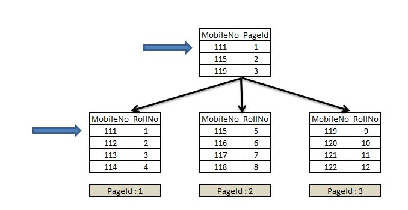
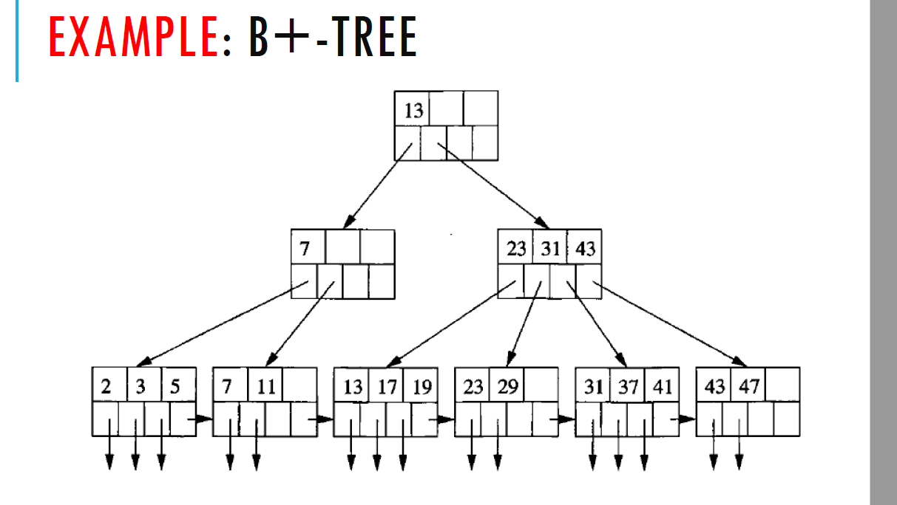

---

# Database Systems Fundamentals: Indexing & Query Processing 🗃️  


## [Lesson 14]  
### **Key Concepts**  

#### **Indexes Overview**  
- **Purpose**: Speed up data retrieval by creating lookup structures.  
- **Without Indexes**: Queries require full table scans (inefficient for large datasets).  

#### **Types of Indices**  
1. **Ordered Indices**:  
- **Clustering (Primary) Index**: Records sorted by search key (often PK).  
 


- **Non-Clustering (Secondary) Index**: Records not sorted by search key.  
 

2. **Hashed Indices**:  
- Uses hash functions to map keys to buckets.  
- Example:  
  ```sql
  CREATE INDEX ON users USING hash (id);
  ```

#### **B+ Tree Structure**  
- **Balanced tree** with sorted keys; leaf nodes linked for range queries.  
  

- **Search Process**:  
  

---

## [Lesson 15]  
## **Key Concepts**  

### 1. **Query Processing Steps**  
   - **Parsing**: SQL → Parse Tree → Relational Algebra  
   - **Optimization**: Choose the cheapest plan using cost models  
   - **Execution**: Run the annotated query plan  

   ```plaintext
   SQL Query → Parser → Optimizer → Execution Plan → Results
   ```

### 2. **Query Evaluation Plans**  
   - **Annotations**: Specify algorithms (e.g., `σ salary<75000; use index`)  
   - **Example Plan**:  
     ```
     π name
     ⋈ (id = employee_id)
     Employees (Index Scan)
     Salaries (File Scan)
     ```

### 3. **Join Algorithms**  
| **Algorithm**       | **Description**              | **When to Use**          |  
|---------------------|-----------------------------|--------------------------|  
| **Nested-Loop**     | Compare all tuples           | Small tables             |  
| **Merge Join**      | Merge sorted inputs          | Pre-sorted data          |  
| **Indexed NL**      | Use index for inner table    | Indexed join column      |  

### 4. **Cost Calculation**  
   - **Traditional (HDD)**:  
     ``` 
     Cost = (Blocks × 0.1ms) + (Seeks × 4ms)
     ```  
   - **SSD**: 10× faster seeks (~90µs)  

### 5. **Pipelining**  
   - **Iterator Model**:  
     ```python
     def get_next():
         return next_tuple  # Parent pulls data from child
     ```  
   - **Benefits**: Avoids temporary storage  

### 6. **Modern Optimizations**  
   - **Cache-Conscious**: Fit operations in CPU cache 

   - **Query Compilation**: Convert plans to machine code  
   
---

### **Key Takeaways**  
1. **Optimizers:** minimize resource usage (I/O, CPU)  
2. **Pipelining:** Materialization when possible  
3. **Cost Models:** evolve with hardware (SSDs reduce I/O bottleneck)  
--- 

### Reflection
This unit has developed my appreciation for database optimization techniques, recognizing how proper indexing strategies like B+ trees and hash indexes serve distinct purposes in balancing read/write performance. The query processing insights particularly stood out, revealing how execution plan selection can dramatically impact operational efficiency. 

I've learned to approach database design pragmatically - while adhering to normalization principles when possible, I now understand when and how to make measured compromises for performance gains. The knowledge gained provides a solid foundation for designing and troubleshooting efficient, production-grade database solutions.

--- 
