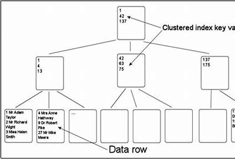
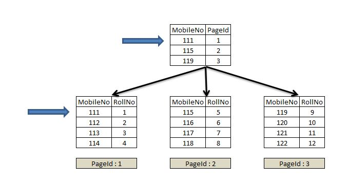
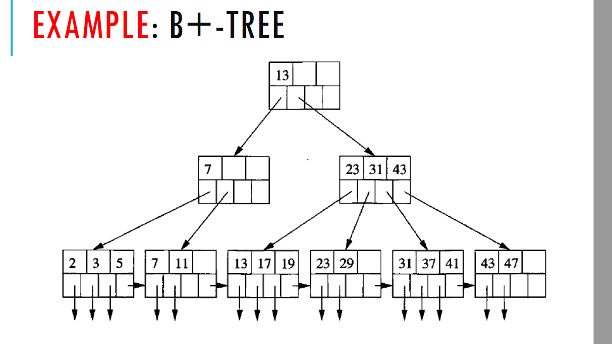
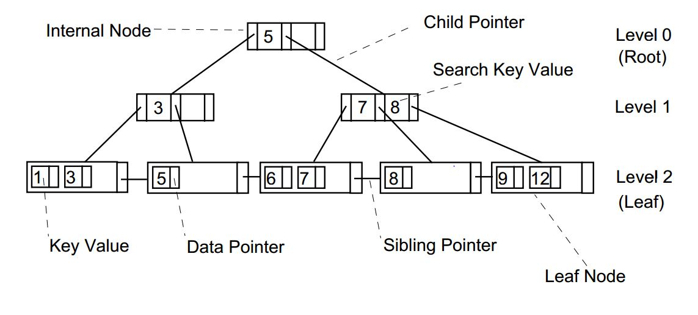

---

# Database Systems Fundamentals: Indexing & Query Processing 🗃️  


## [Lesson 14]  
### **Key Concepts**  

#### **Indexes Overview**  
- **Purpose**: Speed up data retrieval by creating lookup structures.  
- **Without Indexes**: Queries require full table scans (inefficient for large datasets).  

#### **Types of Indices**  
1. **Ordered Indices**:  
- **Clustering (Primary) Index**: Records sorted by search key (often PK).  
 


- **Non-Clustering (Secondary) Index**: Records not sorted by search key.  
 

2. **Hashed Indices**:  
- Uses hash functions to map keys to buckets.  
- Example:  
  ```sql
  CREATE INDEX ON users USING hash (id);
  ```

#### **B+ Tree Structure**  
- **Balanced tree** with sorted keys; leaf nodes linked for range queries.  
  

- **Search Process**:  
  

---

## [Lesson 15]  
## **Key Concepts**  

### 1. **Query Processing Steps**  
   - **Parsing**: SQL → Parse Tree → Relational Algebra  
   - **Optimization**: Choose the cheapest plan using cost models  
   - **Execution**: Run the annotated query plan  

   ```plaintext
   SQL Query → Parser → Optimizer → Execution Plan → Results
   ```

### 2. **Query Evaluation Plans**  
   - **Annotations**: Specify algorithms (e.g., `σ salary<75000; use index`)  
   - **Example Plan**:  
     ```
     π name
     ⋈ (id = employee_id)
     Employees (Index Scan)
     Salaries (File Scan)
     ```

### 3. **Join Algorithms**  
| **Algorithm**       | **Description**              | **When to Use**          |  
|---------------------|-----------------------------|--------------------------|  
| **Nested-Loop**     | Compare all tuples           | Small tables             |  
| **Merge Join**      | Merge sorted inputs          | Pre-sorted data          |  
| **Indexed NL**      | Use index for inner table    | Indexed join column      |  

### 4. **Cost Calculation**  
   - **Traditional (HDD)**:  
     ``` 
     Cost = (Blocks × 0.1ms) + (Seeks × 4ms)
     ```  
   - **SSD**: 10× faster seeks (~90µs)  

### 5. **Pipelining**  
   - **Iterator Model**:  
     ```python
     def get_next():
         return next_tuple  # Parent pulls data from child
     ```  
   - **Benefits**: Avoids temporary storage  

### 6. **Modern Optimizations**  
   - **Cache-Conscious**: Fit operations in CPU cache 

   - **Query Compilation**: Convert plans to machine code  
   

## [Lesson 16]  
### **Key Concepts**  

#### **Query Optimization Overview**  
- **Purpose**: Select the most efficient query-evaluation plan to minimize execution time and resource usage.  
- **Without Optimization**: Queries may use suboptimal plans, leading to slow performance (e.g., large intermediate results).  

#### **Equivalence Rules**  
1. **Selection Operations**:  
   - **Deconstruction**:  
     \[ \sigma_{\theta1 \land \theta2}(E) \equiv \sigma_{\theta1}(\sigma_{\theta2}(E)) \]  
   - **Commutativity**:  
     \[ \sigma_{\theta1}(\sigma_{\theta2}(E)) \equiv \sigma_{\theta2}(\sigma_{\theta1}(E)) \]  

2. **Join Operations**:  
   - **Commutativity**:  
     \[ E1 \rtimes_\theta E2 \equiv E2 \rtimes_\theta E1 \]  
   - **Associativity**:  
     \[ (E1 \bowtie E2) \bowtie E3 \equiv E1 \bowtie (E2 \bowtie E3) \]  
   - **Selection Distribution**:  
     \[ \sigma_{\theta1}(E1 \bowtie_\theta E2) \equiv (\sigma_{\theta1}(E1)) \bowtie_\theta E2 \quad \text{(if } \theta1 \text{ involves only } E1) \]  

#### **Join Ordering**  
- **Goal**: Reduce intermediate result sizes by reordering joins.  
- **Example**:  
  - **Efficient**: `(instructor ⋈ teaches) ⋈ Π_course_id,title(course)`  
  - **Inefficient**: `(instructor ⋈ Π_course_id,title(course)) ⋈ teaches`  

#### **Cost-Based Optimization**  
- **Steps**:  
  1. Generate equivalent plans using equivalence rules.  
  2. Estimate costs (e.g., I/O, CPU) for each plan.  
  3. Select the plan with the lowest cost.  
- **Join Algorithms**:  
  - **Nested Loop Join**: Best for small relations.  
  - **Hash Join**: Efficient for large, unsorted datasets.  
  - **Sort-Merge Join**: Optimal for presorted data.  

#### **Optimization Heuristics**  
1. **Early Selection**: Apply filters (`WHERE`) first to reduce data volume.  
   ```sql
   SELECT * FROM R WHERE R.E > 10;

2. **Early Projection**: Retain only needed columns after selections.  
3. **Left-Deep Join Trees**: Enable pipelining for faster execution.  

#### **Nested Subqueries**  
- **Problem**: Correlated subqueries execute repeatedly (inefficient).  
- **Solution**: Decorrelate using joins/semijoins.  
  - **Original**:  
    ```sql
    SELECT name FROM instructor  
    WHERE EXISTS (SELECT * FROM teaches  
                  WHERE instructor.ID = teaches.ID AND teaches.year = 2019);  
    ```  
  - **Optimized**:  
    ```sql
    SELECT name FROM instructor ⋉_{instructor.ID=teaches.ID \land teaches.year=2019} teaches;  
    ```  

## Reflection

This unit, i learned the understanding of database optimization, blending key concepts from indexing strategies to query processing and execution planning. By studying B+ trees and hash indexes, I learned how different indexing methods optimize read/write performance for varying workloads. The query optimization lessons was valuable, revealing how databases use equivalence rules, cost-based analysis, and join ordering to transform inefficient queries into high-performance execution plans. I now know the importance of balancing theoretical principles like normalization with practical optimizations—such as early filtering, left-deep joins, and subquery decorrelation—to achieve real-world efficiency. These insights have equipped me with a structured approach to designing, troubleshooting, and fine-tuning databases, ensuring they meet both functional and performance demands in production environments.