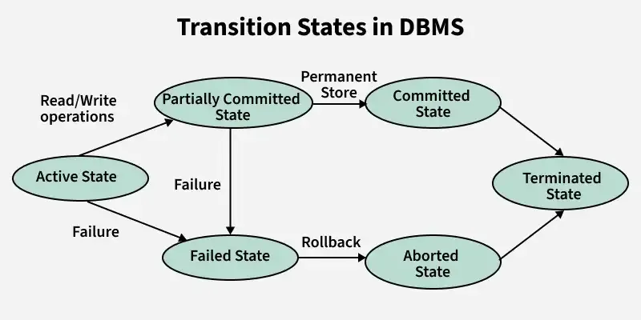
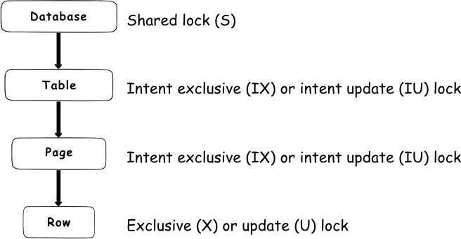
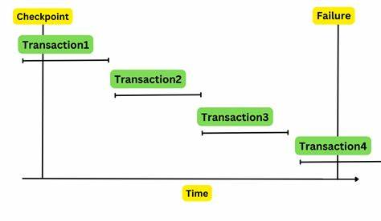

# Database Systems Fundamentals: Transactions & Recovery 🔄  

## [Lesson 18]  
### **Key Concepts**  

#### **Transactions Overview**  
- **Definition**: A logical unit of work that accesses/modifies data.  
- **ACID Properties**:  
  - **Atomicity**: All or nothing execution.  
  - **Consistency**: Preserves database invariants.  
  - **Isolation**: Concurrent transactions appear serial.  
  - **Durability**: Committed changes survive failures.  

#### **Transaction States** 
 

1. **Active**: Executing operations.  
2. **Partially Committed**: After final operation, before commit.  
3. **Committed**: Changes persisted.  
4. **Failed**: Aborted due to errors.  
5. **Aborted**: Rolled back to pre-transaction state.  

#### **Concurrency Control**  
- **Problem**: Interleaved operations may violate isolation (e.g., lost updates, dirty reads).  
- **Solution**: **Serializable schedules** (conflict-equivalent to a serial schedule).  
- **Precedence Graph**: Detects cycles to test conflict serializability.  

#### **Isolation Levels**  
| Level              | Dirty Reads | Non-Repeatable Reads | Phantoms |  
|--------------------|-------------|----------------------|----------|  
| **Read Uncommitted** | ✅           | ✅                    | ✅        |  
| **Read Committed**   | ❌           | ✅                    | ✅        |  
| **Repeatable Read**  | ❌           | ❌                    | ✅        |  
| **Serializable**     | ❌           | ❌                    | ❌        |  

---

## [Lesson 19]  
### **Key Concepts**  

#### **Locking Mechanisms**  
- **Shared Lock (S)**: Read-only access (multiple transactions allowed).  
- **Exclusive Lock (X)**: Read/write access (no other locks allowed).  
- **Compatibility Matrix**:  
  |   | S  | X  |  
  |---|----|----|  
  | S | ✅ | ❌ |  
  | X | ❌ | ❌ |  

#### **Two-Phase Locking (2PL)**  
- **Growing Phase**: Acquire locks (no releases).  
- **Shrinking Phase**: Release locks (no acquisitions).  
- **Strict 2PL**: Hold X-locks until commit/abort (no cascading aborts).  

#### **Deadlocks**  
- **Detection**: Waits-for graph (cycles = deadlock).  
- **Prevention**:  
  - **Wait-Die**: Older transactions wait; younger abort.  
  - **Wound-Wait**: Older transactions abort younger.  

#### **Lock Granularity**  

- **Hierarchy**: Database → Table → Page → Tuple → Attribute.  
- **Intention Locks**:  
  - **IS**: Intent to acquire S-locks downstream.  
  - **IX**: Intent to acquire X-locks downstream.  
  - **SIX**: S-lock on node + IX downstream.  

#### **Optimistic vs. Pessimistic CC**  
- **Pessimistic (2PL)**: Assume conflicts; lock proactively.  
- **Optimistic**: Validate at commit; restart if conflicts.  

#### **Multi-Version Concurrency Control (MVCC)**  
- **Snapshot Isolation**: Transactions see a consistent snapshot.  
- **Advantages**: Readers don’t block writers (no locks for reads).  
- **Write Skew Anomaly**: Concurrent disjoint updates may violate consistency.  

---

## [Lesson 20]  
### **Key Concepts**  

#### **Recovery Systems**  
- **Why Needed?**: Handle failures (system crashes, human errors, disk corruption).  
- **Log-Based Recovery**: Records all changes (undo/redo).  

#### **Log Records**  
- **Format**: `<Ti, Xj, V1, V2>` (Transaction, Data Item, Old Value, New Value).  
- **Types**:  
  - `<Ti start>`: Transaction begins.  
  - `<Ti commit>`: Transaction commits.  
  - `<Ti abort>`: Transaction aborts.  

#### **Undo vs. Redo**  
- **Undo(Ti)**: Rollback uncommitted changes (restore old values).  
- **Redo(Ti)**: Reapply committed changes (ensure durability).  

#### **Checkpoints**  

- **Steps**:  
  1. Write all log records to disk.  
  2. Flush dirty buffer blocks.  
  3. Write checkpoint record (list of active transactions).  
 **Purpose**: Limit log scan during recovery. 
#### **ARIES Recovery Algorithm**  
1. **Analysis Pass**: Identify dirty pages and transactions to undo/redo.  
2. **Redo Pass**: Replay history (repeat all actions).  
3. **Undo Pass**: Rollback incomplete transactions.  

#### **Remote Backup & High Availability**  
- **Hot-Spare**: Continuously replay logs for fast failover.  
- **Trade-offs**: Durability levels (one-safe, two-safe).  

---

## Reflection  
This unit provided profound insights into how databases maintain reliability and consistency under demanding conditions. Through studying transaction management, I've come to appreciate how ACID properties; Atomicity, Consistency, Isolation, and Durability form the bedrock of data integrity, with mechanisms like two-phase locking and write-ahead logging working in concert to ensure operations either complete fully or not at all. The exploration of concurrency control revealed critical trade-offs between performance and correctness, particularly when analyzing isolation levels and deadlock scenarios. Recovery systems like ARIES demonstrated sophisticated approaches to fault tolerance, where checkpoints and log-based recovery create a safety net against system failures. These concepts have reshaped my understanding of what makes enterprise-grade databases resilient, showing how theoretical foundations translate into practical solutions for maintaining data accuracy during concurrent access and after unexpected disruptions.  

