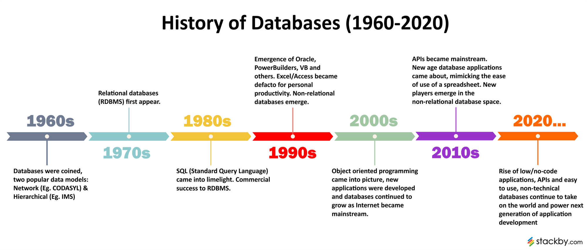
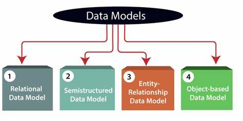

#### Topic : Database Systems Fundamentals

----
## [ Lesson 1]
•The purpose of database systems: 
    Database systems are needed to manage collections of data that are highly valuable, relatively large, and
    accessed by multiple users and applications, often simultaneously. They combine various types of data into
    a unified repository of information.

•Use of database system applications in various industries:
    Examples of database systems in use include:
    -Banking and finance for transaction processing and customer information systems
    -Social media
    -Sales
    -Navigation systems

 Evolution of database systems.
 

# Key Concepts
-Data Collection of facts.
-Database An organized collection of structured information, typically stored electronically.
-Database Management System (DBMS) A collection of interrelated data and a set of programs to access that data.
-Database System Database + Database Management System.

# Why Database Systems?
•Inefficient File-Processing Systems The traditional method of storing data has several disadvantages:
-Data redundancy and inconsistency
-Difficulty in accessing data
-Data isolation
-Integrity problems
-Atomicity problems
-Concurrent-access anomalies
-Security problems

# Advantages of Database Systems:
-Data consistency
-Scalability and flexibility
-Reduction in data redundancy
-Better security
-Data Abstraction

## [Lesson 2]

# Different types of data models used in database design.

•Data Models: 
These are conceptual tools that describe data, data relationships, data semantics, and consistency constraints.

# Database languages and their applications

•Database Languages: These are essential for interacting with databases.

-Data-definition language: Used to specify the database schema, domain constraints, referential integrity, and authorization. An example of SQL DDL is creating a table.

-Data-manipulation language: Enables users to access or manipulate data as organized by the appropriate data model. Types of access include retrieval, insertion, deletion, and modification. DMLs can be procedural (specifying what data are needed and how to get them) or declarative/nonprocedural (specifying what data are needed without specifying how to get them). SQL query language is non-procedural. A query is a statement requesting the retrieval of information.

# Fundamentals of  database system architecture and their components

-Database System Architecture and Components:
-Database Engine: This is a library/software in a DBMS that manages disk storage and performs CRUD operations. It's also called a storage engine or embedded database. Some databases allow changing database engines.

~Functional Components of a Database Engine:
▪Storage Manager: Provides the interface between the low-level data stored in the database and the application programs and queries submitted to the system.

▪Query Processor: Includes a DDL interpreter, DML compiler, and query evaluation engine.

▪Transaction Management: Consists of the concurrency-control manager and the recovery manager.

